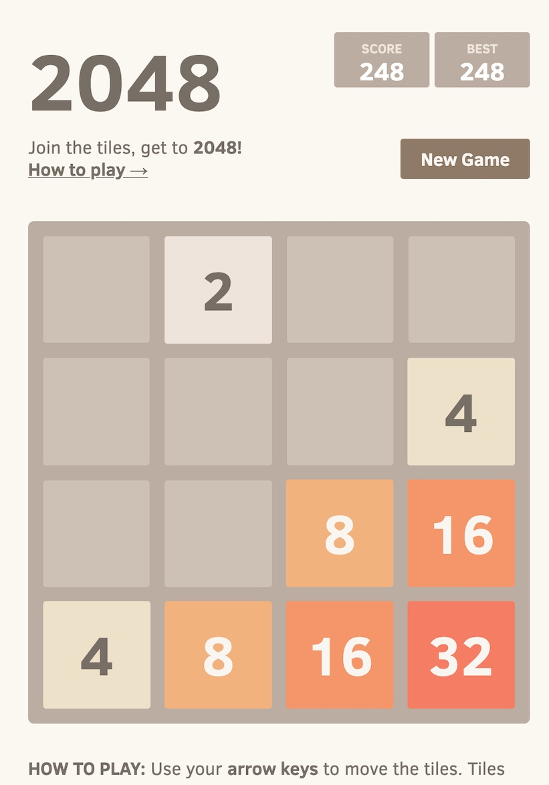

# Playbook - strategies for 2048

A didactic catalog of AI strategies for [2048](https://play2048.co), built so you
can **try a new idea and evaluate it with a single command**, without reading the
whole codebase. Strategies are grouped by technique into recognizable "chapters":
search, optimization, machine learning and reinforcement learning.



## Install

```bash
pip install -e .            # core (numpy)
pip install -e ".[browser]" # + drive the live game in Chrome (websocket-client)
pip install -e ".[deep]"    # + deep-RL strategies (torch)
pip install -e ".[dev]"     # + pytest
```

## Quick start

```bash
python -m playbook list                                            # all strategies
python -m playbook compare --strategies random,greedy,expectimax   # head-to-head table
python -m playbook eval  --strategy expectimax --depth 3 --games 10
python -m playbook train --strategy ntuple --episodes 20000 --save ntuple.npz
python -m playbook eval  --strategy ntuple --weights ntuple.npz --games 50
python -m playbook play  --strategy mcts --env browser             # live, in Chrome
```

Playing live needs Chrome started with remote debugging and the game open:

```bash
/Applications/Google\ Chrome.app/Contents/MacOS/Google\ Chrome --remote-debugging-port=9222
# then open https://play2048.co in that window
```

## Layout

```
playbook/
  game/         rules + simulator + environments (the "world")
  heuristics/   reusable board-evaluation functions (the "ideas")
  strategies/   the players, grouped by technique:
      baselines/      random · greedy · manual
      search/         maximization · minimax · expectimax · mcts
      optimization/   genetic (+ room for cma-es, annealing, hillclimb)
      learning/
          supervised/     imitation
          reinforcement/  tabular · ntuple (worked) · deep (dqn)
  evaluation/   run games, aggregate metrics, compare strategies
  registry.py   name -> strategy
  cli.py        the command line above
```

Every player implements one tiny interface,
`Strategy.select_move(board, legal) -> Move`. **To add an idea, copy the closest
file in the relevant family, rewrite that one method, and register a name** in
[`registry.py`](playbook/registry.py). Each family folder has a `README.md`
explaining the technique.

## Strategies

| Family | Strategies |
|---|---|
| Baselines | `random`, `greedy`, `manual` |
| Search | `maximization`, `minimax`, `expectimax`, `mcts` |
| Optimization | `genetic` |
| Reinforcement learning | `ntuple` (worked), `qlearning` (scaffold), `dqn` (scaffold) |
| Supervised | `imitation` (scaffold) |

The `ntuple` agent (temporal-difference learning on afterstates) is the
recommended starting point for RL — it learns strong play on a CPU with no
neural network.

## Heuristics

Monotonicity · gradients (corner anchoring) · free tiles · immediate merges ·
total sum · max tile. Combined with explicit weights via
[`CombinedHeuristic`](playbook/heuristics/combined.py); tune them with the
`genetic` strategy or CMA-ES (`[tune]` extra).

## Tests

```bash
pytest        # board mechanics are pinned to the original game via a golden fixture
```

## Interesting links

- [What is the optimal algorithm for the game 2048?](https://stackoverflow.com/questions/22342854/what-is-the-optimal-algorithm-for-the-game-2048)
- [Efficient C++ implementation](https://github.com/nneonneo/2048-ai)
- Szubert & Jaśkowski, *Temporal Difference Learning of N-Tuple Networks for the Game 2048* (2014) — the basis for the `ntuple` strategy
- [How the AI crushed all human records in 2048](http://www.randalolson.com/2015/04/27/artificial-intelligence-has-crushed-all-human-records-in-2048-heres-how-the-ai-pulled-it-off/)
- The Mathematics of 2048: [MDPs / optimal play](https://jdlm.info/articles/2018/03/18/markov-decision-process-2048.html)
