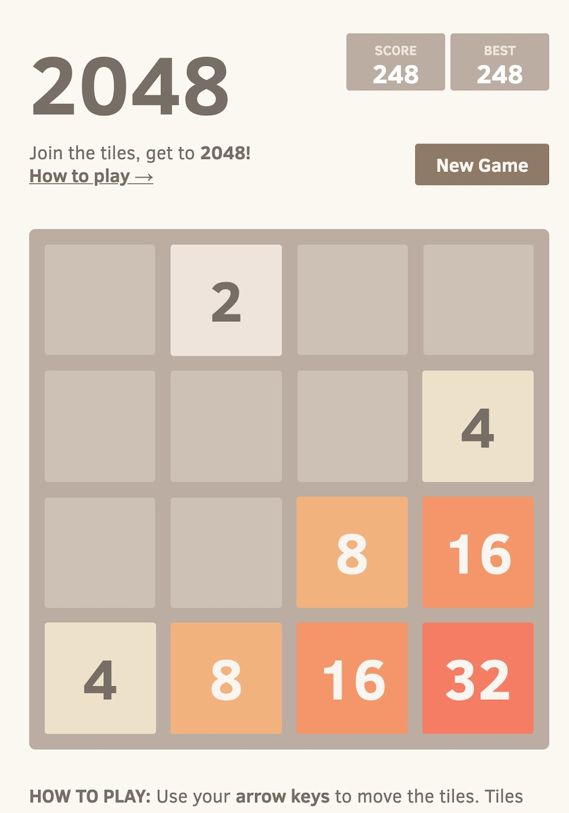

# Playbook: strategies for 2048




A didactic catalog of AI strategies for [2048](https://classic.play2048.co), built so you can **try a new idea and benchmark it with a single command**, without reading the whole codebase. Every strategy is a small, self-contained file grouped by technique into recognizable "chapters": baselines, search, optimization and (reinforcement) learning. A fast in-memory simulator drives training and evaluation; the exact same strategy can also play a live game in Chrome over the DevTools protocol.

> Clarity over raw performance. The point is to make it obvious *where* an idea lives and *how* to add your own.

## Highlights

- **One interface for every player**: `select_move(board, legal) -> Move`. That is the whole contract.
- **Strategies grouped by technique**: search (minimax, expectimax, MCTS…), optimization (genetic), reinforcement learning (tabular Q-learning, n-tuple TD, DQN), supervised (imitation).
- **GPU-trained neural players**: a DQN that learns the value of afterstates and an imitation student distilled from it, trained on a batched simulator that plays hundreds of games at once (~500k random moves/s vs ~3k for the one-game simulator).
- **Reusable heuristics**: monotonicity, corner gradients, free tiles, merges… combined with explicit weights, no hidden globals.
- **Simulator *or* live browser** behind the same `Env` API, so a strategy you trained offline can play the real game unchanged.
- **Watch it play and learn from it**: step through a live game move by move (`--delay` / `--step`) while the strategy shows the score it gave each candidate move (`--explain`).
- **Reproducible benchmarks**: one script runs any subset of strategies over the same seeded games and prints a table (and a Markdown table for this README).
- **Pinned mechanics**: the board engine is frozen against a golden fixture of 1600 transitions, so refactors can't silently change the game.

## Install

```bash
pip install -e .             # core (numpy only)
pip install -e ".[browser]"  # + play the live game in Chrome (websocket-client)
pip install -e ".[deep]"     # + neural strategies: dqn, imitation (torch)
pip install -e ".[dev]"      # + pytest
```

Trained weights for every learner ship with the repo, and playing with them runs fine on a CPU (`dqn` plays ~1,000 moves/s): a GPU only matters for *training*. To train the neural strategies on an NVIDIA GPU, install a CUDA build of torch first. The CUDA 12.6 build still supports older cards such as a GTX 1070 (Pascal), which newer builds dropped:

```bash
pip install torch --index-url https://download.pytorch.org/whl/cu126
```

## Quick start

```bash
python -m playbook list                                            # every strategy
python -m playbook compare --strategies random,greedy,expectimax   # head-to-head table
python -m playbook eval  --strategy expectimax --depth 3 --games 10
python -m playbook train --strategy ntuple --episodes 20000 --save ntuple.npz
python -m playbook eval  --strategy ntuple --weights ntuple.npz --games 50
python -m playbook eval  --strategy dqn --weights playbook/strategies/learning/reinforcement/deep/dqn.pt --depth 1
python -m playbook play  --strategy mcts --env browser             # live, in Chrome
```

To play the live game, start Chrome with remote debugging and open the board in that window:

```bash
/Applications/Google\ Chrome.app/Contents/MacOS/Google\ Chrome --remote-debugging-port=9222 --remote-allow-origins="*"
# then navigate to https://classic.play2048.co
```

## Watch it play and learn from it

Watching a strong player move by move is the fastest way to build intuition. The `play` command renders every move; pace it and it explains itself: every search player (plus `greedy` and `ntuple`) reports the score it gave each candidate move, so you can see the ranking behind its choice:

```bash
# Slow it down in the terminal simulator and see *why* each move is chosen
python -m playbook play --strategy expectimax --depth 3 --delay 0.4

# Step through one move at a time (press Enter to advance)
python -m playbook play --strategy ntuple --weights ntuple.npz --step

# Live in Chrome (see the setup above) - the explanation prints in the terminal
python -m playbook play --strategy mcts --env browser --delay 0.3
```

```text
move #160 [UP]  score=2048
       UP       25071.7  <-- chosen
     LEFT       24763.0
    RIGHT       23181.6
     DOWN       13798.8
    32    256     32      2
     2     16      8      0
     8      2      4      0
     4      0      0      4
```

| Flag | Effect |
|---|---|
| `--delay <seconds>` | pause between moves so you can follow along |
| `--step` | wait for Enter before each move |
| `--explain` / `--no-explain` | show or hide the per-move scores (on by default) |

Each strategy's number is on its own scale: immediate points for `greedy`, the heuristic value of the look-ahead for the search players, the learned `reward + V(afterstate)` (in points) for `ntuple` and `dqn`, the Q-table entry for `qlearning`, and the student's confidence (%) for `imitation`. Read the *ranking*, not the absolute value.

## Strategies

| Strategy | Family | Idea | Reaches 2048? |
|---|---|---|:--:|
| `random` | baseline | pick any legal move (the floor everything beats) | ✗ |
| `greedy` | baseline | the move with the best immediate score | ✗ |
| `manual` | baseline | you type the moves (for debugging / playing) | depends on you |
| `maximization` | search | look ahead, assume an average random spawn | ✓ |
| `minimax` | search | α-β, treats the spawn as an adversary | ✓ |
| `expectimax` | search | α-β over the *real* 2/4 spawn distribution (the classic strong baseline) | ✓✓ |
| `mcts` | search | random rollouts from each candidate move | ✓ |
| `genetic` | optimization | evolve the weights of a heuristic player | ✓ |
| `qlearning` | reinforcement (tabular) | a Q-table over a coarse summary of the board: learns, and shows why tables don't scale | ✗ |
| `ntuple` | reinforcement (TD) | learn a value function over tile patterns, no neural net | ✓✓✓ |
| `dqn` | reinforcement (deep) | a neural net learns the value of afterstates: replay buffer, target network, n-step returns (GPU) | ✓✓✓✓ |
| `imitation` | supervised | a conv policy net distilled from `dqn` + lookahead, with DAgger and soft targets (GPU) | ✓✓✓ |

Search strategies take a `--depth` (and `--runs` for MCTS) and an injectable `--heuristic`. The two players that learn a value of afterstates (`ntuple`, `dqn`) also take `--depth`: expectimax levels searched before trusting the learned value (`--depth 1` averages over every possible spawn after each move; see [`search/lookahead.py`](playbook/strategies/search/lookahead.py)). The `ntuple` agent is the recommended entry point into RL: it learns strong play on a CPU in minutes, with no neural network. `dqn` and `imitation` need torch and, to train in reasonable time, a GPU; trained weights for every learner ship with the repo.

## Results

Reproduce on your machine. Every strategy plays the same seeded games:

```bash
python benchmark.py --strategies all --games 50 --markdown
python benchmark.py --strategies ntuple,dqn --lookahead 1 --games 50 --markdown   # learned value + search
```

Example run (50 games, seed 0; tree search at depth 3, `mcts` at 20 runs × depth 20; the learners use the bundled weights; `(depth 1)` adds one level of expectimax on top of the learned value). Measured on a Windows desktop with a GTX 1070; the CPU-only players ran while the GPU models were training, so their moves/s are pessimistic. Numbers vary by machine and seed; regenerate with the commands above.

| Strategy | Avg score | Best | 2048 rate | 4096 rate | Top tile | Avg moves | Moves/s |
|---|--:|--:|--:|--:|--:|--:|--:|
| `dqn (depth 1)` | 84,160 | 133,008 | 100% | 98% | 8,192 | 3758 | 613 |
| `dqn` | 45,732 | 79,388 | 86% | 52% | 4,096 | 2164 | 730 |
| `imitation` | 42,299 | 80,536 | 84% | 34% | 4,096 | 2072 | 426 |
| `ntuple (depth 1)` | 42,212 | 75,988 | 94% | 28% | 4,096 | 2102 | 1,168 |
| `ntuple` | 29,163 | 59,680 | 68% | 8% | 4,096 | 1522 | 1,219 |
| `mcts` | 12,406 | 26,972 | 6% | 0% | 2,048 | 731 | 6 |
| `expectimax` | 10,653 | 25,624 | 10% | 0% | 2,048 | 658 | 19 |
| `maximization` | 9,389 | 16,500 | 0% | 0% | 1,024 | 591 | 62 |
| `minimax` | 6,843 | 16,224 | 0% | 0% | 1,024 | 469 | 112 |
| `greedy` | 3,354 | 7,780 | 0% | 0% | 512 | 277 | 2,324 |
| `qlearning` | 2,425 | 3,992 | 0% | 0% | 256 | 210 | 2,062 |
| `random` | 1,078 | 2,740 | 0% | 0% | 256 | 117 | 2,811 |

Read the table as two questions: *how strong* (avg/best score, 2048/4096 rates, top tile) and *how cheap* (moves/s). `greedy` and `random` are essentially free but plateau early; the search players trade speed for strength: `expectimax` is principled but pays per move for its lookahead, and `mcts` (random rollouts scored by the points they earn) is the strongest hand-written searcher but the slowest. The learners do their expensive work once, during training (`ntuple` on a CPU in minutes, `dqn` and `imitation` on a GPU in a couple of hours), then play both stronger *and* faster. `dqn` is the strongest player in the catalog, and with one level of lookahead on top of its learned value it reaches 4096 in 98% of games. `imitation` shows how far a purely reactive policy (one forward pass per move, no simulation at all) gets by copying it. `qlearning` sits between `random` and `greedy`: the table learns, but it cannot generalize from one board to the next, which is the point of that chapter.

## Training the neural players on a GPU

`dqn` and `imitation` were trained on a GTX 1070 (8 GB); the exact recipes are in [`deep/README.md`](playbook/strategies/learning/reinforcement/deep/README.md) and [`supervised/README.md`](playbook/strategies/learning/supervised/README.md). What each learner reaches on fresh games:

| Learner | Training | Avg score | 2048 | 4096 | 8192 |
|---|---|--:|--:|--:|--:|
| `qlearning` (table) | CPU, ~45 min | 2,490 | 0% | 0% | 0% |
| `ntuple` (bundled) | CPU | 28,150 | 62% | 6% | 0% |
| `imitation` (policy net, no search) | GPU, ~30 min, distilled from `dqn --depth 1` | 39,327 | 83% | 29% | 0% |
| `dqn` (value net, greedy) | GPU, ~2 h + 12 min fine-tune | 41,229 | 79% | 48% | 0% |
| `dqn --depth 1` | (same net + one level of expectimax) | 80,402 | 99% | 95% | 14% |

(200–300 batched games each, separate from the seeded benchmark in [Results](#results).)

Three things made the difference, all explained in the chapter READMEs:

- **A batched simulator.** One Python game manages ~3k moves/s; [`VecSimEnv`](playbook/game/vector.py) plays hundreds of games at once through table lookups, so the GPU always has a full batch (~20k moves/s *including* learning).
- **n-step returns for the DQN.** With 1-step targets the net predicted ~20 points from an opening board worth thousands, so it played like a heuristic. Summing the points of the next 10 moves before bootstrapping doubled the score reached in the same 8 minutes of training (~10k → ~21k average); a 2-hour run then got to ~35k, and a short phase at a lower learning rate to 4096 in half the games.
- **Soft targets for imitation.** Copying the teacher's move gets 4096 in 9% of games; learning the teacher's whole `softmax(Q / T)` over moves, from the same data, gets 29%.

## How it works

Three decoupled layers with a registry and CLI on top:

```text
playbook/
  game/         the world: board mechanics, rules, and the Env (sim + browser)
      vector.py       the same game on a batch of boards (feeds the GPU)
  heuristics/   reusable board-evaluation functions (the shared "ideas")
  strategies/   the players, grouped by technique:
      baselines/      random · greedy · manual
      search/         maximization · minimax · expectimax · mcts
                      + lookahead: batched expectimax over a learned value
      optimization/   genetic   (+ room for cma-es, annealing, hill-climb)
      learning/
          networks.py     the neural nets (value / policy), shared
          supervised/     imitation
          reinforcement/  tabular (q-learning) · ntuple (worked) · deep (dqn)
  evaluation/   play games, aggregate metrics, compare strategies
  registry.py   name -> strategy factory
  cli.py        the commands shown above
benchmark.py    the Results table above
```

Boards are 4×4 numpy arrays of log2 exponents (`0`=empty, `1`=tile 2, …, `11`=2048). The `Env` is the seam that lets one strategy run against the fast simulator or a live Chrome tab without knowing which. Search strategies receive a heuristic and never know which one; learning strategies add a `Trainable` mixin (`train` / `observe` / `save` / `load`) and learn on *afterstates* (the board after the slide+merge, before the random spawn).

The neural players train on `VecSimEnv` ([`game/vector.py`](playbook/game/vector.py)): every row of four tiles packs into a 16-bit number, so the left-collapse of all 65,536 possible rows is precomputed once, with the canonical rule, and a move on a whole batch of boards becomes table lookups. It is checked against the same golden fixture as the scalar engine. Strategies also expose a batched `select_moves(boards)` (by default a loop over `select_move`), which is how a teacher labels thousands of boards at once.

## Create your own strategy

Adding an idea is three steps and never touches the engine:

1. **Copy the closest file** in the relevant family (e.g. [`strategies/search/expectimax.py`](playbook/strategies/search/expectimax.py)) and rewrite the one method that matters:

   ```python
   from playbook.strategies.base import Strategy

   class CornerStrategy(Strategy):
       name = "corner"
       def select_move(self, board, legal):
           # board: 4x4 log2 exponents; legal: set[Move]; return a Move.
           return max(legal)   # your idea here
   ```

2. **Register a name**: one line in [`registry.py`](playbook/registry.py) (use a local import so optional deps load only when requested):

   ```python
   reg["corner"] = lambda **c: CornerStrategy(**c)
   ```

3. **Run it**: `python -m playbook eval --strategy corner --games 20`, then add it to the benchmark and compare.

If your strategy *learns*, also mix in `Trainable` and implement `observe` / `train` / `save` / `load`; the `ntuple` agent in [`strategies/learning/reinforcement/ntuple/`](playbook/strategies/learning/reinforcement/ntuple/ntuple.py) is a complete worked example. Each family folder has a `README.md` describing the technique and what to keep in mind.

## Tests

```bash
pytest
```

The board mechanics are pinned to the original game by a golden fixture (`tests/fixtures/moves.json`): 400 seeded boards × 4 moves, regenerated from the pre-refactor engine. If a change to the board silently alters the game, these fail.

## References

- [What is the optimal algorithm for the game 2048?](https://stackoverflow.com/questions/22342854/what-is-the-optimal-algorithm-for-the-game-2048): the canonical discussion of expectimax + heuristics.
- Szubert & Jaśkowski, *Temporal Difference Learning of N-Tuple Networks for the Game 2048* (2014): the basis for the `ntuple` strategy.
- [nneonneo/2048-ai](https://github.com/nneonneo/2048-ai): a fast C++ expectimax implementation.
- [How an AI crushed all human 2048 records](http://www.randalolson.com/2015/04/27/artificial-intelligence-has-crushed-all-human-records-in-2048-heres-how-the-ai-pulled-it-off/) and [the MDP view of 2048](https://jdlm.info/articles/2018/03/18/markov-decision-process-2048.html).
